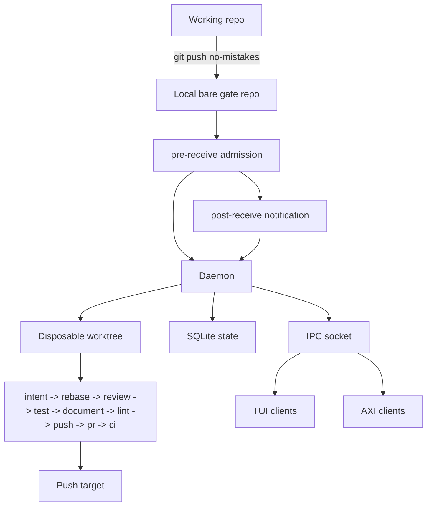

`no-mistakes` intercepts pushes by placing a local bare git repo between your
working repo and the configured push target. That bare repo is the gate.

The point is not to hide Git. The point is to create one deliberate place where
validation can happen before a branch is shared.

## Architecture overview

## What `no-mistakes init` does

When you run `no-mistakes init` in a repo:

1. It creates a local bare gate repo under `~/.no-mistakes/repos/<id>.git`.
2. It installs a `pre-receive` admission hook and a `post-receive` notification hook in that gate repo.
3. It enables Git push options for the gate repo.
4. It best-effort isolates the gate repo's hooks path from shared local Git config writes when Git supports `config --worktree`.
5. It adds a `no-mistakes` remote to your working repo that points at the gate.
6. When `--fork-url` is supplied, it records that GitHub fork as the branch push target while keeping `origin` as the parent repository used for PR bases.
7. It installs or refreshes the `/no-mistakes` agent skill at user level, into `~/.claude/skills/no-mistakes/SKILL.md` and `~/.agents/skills/no-mistakes/SKILL.md`, on a best-effort basis, following existing symlinks between the home `.claude` and `.agents` skill directories. It writes no skill files into the repo; if the repo still carries a vendored copy from an older version, `init` prints a notice that the copy can be removed.
8. It makes sure the daemon is running so incoming pushes can start runs.

`init` is idempotent.
If the repo is already initialized, it refreshes the existing gate instead of failing: managed hook installation, push-option support, hook-path isolation, gate and working remotes, origin/default-branch metadata, and the `/no-mistakes` agent skill are repaired or updated where needed.
If the working repo was renamed or moved and the old path no longer exists, `init` reattaches the existing gate from the leftover `no-mistakes` remote, updates the stored working path, and preserves the repo ID plus run history.
If the working repo was copied and the original path still exists, `init` treats the copy as a new repo and repoints the copied `no-mistakes` remote to a fresh gate.
If daemon startup fails during a refresh, `init` reports the error but does not eject the pre-existing gate.

After init, your original `origin` still points at the real upstream remote.
With `--fork-url`, that `origin` should be the parent repository, and the fork URL is stored separately for branch pushes.
That is a core design choice, not an implementation detail.

## How a push flows

1. You run `git push no-mistakes <branch>`.
2. The gate repo's `pre-receive` hook asks the daemon to admit the update before Git changes any gate ref. An active validation-step descendant is refused, including a direct push that bypasses the CLI.
3. Git writes an admitted push into the local bare gate repo.
4. The gate repo's `post-receive` hook notifies the daemon.
5. The daemon creates a detached worktree for this run.
6. The pipeline runs in order: `intent -> rebase -> review -> test -> document -> lint -> push -> pr -> ci`.
7. If a step pauses, you can attach with the TUI or use `no-mistakes axi respond` to approve, fix, or skip.
   Use `no-mistakes axi abort` only when you mean to cancel the whole run.
   AXI run objects show `awaiting_agent: parked <duration>` while a non-terminal run is parked at that gate, so a supervising agent can distinguish a waiting run from active work in one status read.
   While a step is actively running or fixing, AXI run objects can also show `active_steps` with the active duration, latest activity, native agent PID, and current execution or fix round.
8. After local checks pass, the push step forwards the branch to the configured push target only after verifying that the update will not discard unincorporated commits already on that target, and the PR step creates or updates the pull request.
   For GitHub fork routing, the push target is the fork and the PR base repository is the parent from `origin`.
9. The CI step keeps watching the open PR until it is merged, closed, or its configured idle timeout elapses with no base-branch movement, and can auto-fix failures or merge conflicts when supported.
   While it watches, the TUI and terminal title surface a `Checks passed` signal once checks are green and the PR is mergeable (or the trusted default-branch config declares [`no_ci: true`](/no-mistakes/reference/repo-config/#no_ci) and no checks are registered), and `no-mistakes axi` returns `outcome: checks-passed` with instructions to summarize the run and list any pipeline fixes, so agents stop and ask you to review and merge it. An empty forge response without that declaration stays not-ready.

**Key design decisions:**

- **Named remote** - `origin` is never hijacked. You push to `no-mistakes` on purpose, so regular `git push` still works normally.
- **Recursive-run containment** - managed gate identity and authenticated daemon peer ancestry prevent active validation steps from starting or controlling another pipeline. `NO_MISTAKES_GATE` is diagnostic evidence only, not authorization.
- **Disposable worktrees** - each run happens in its own detached worktree under `~/.no-mistakes/worktrees/`. The daemon can safely modify files, run tests, and commit fixes without touching your working directory.
- **Fixed pipeline** - the step order is opinionated and not configurable: `intent → rebase → review → test → document → lint → push → pr → ci`. What you _can_ configure is the commands each step runs, how many auto-fix attempts are allowed, and whether transcript-based intent extraction is used when intent is not supplied directly.
- **Remote data-loss guard** - force-pushes are checked against the live push target and refused when they would discard commits the run did not incorporate.

## Why it is built this way

### Named remote

The remote is explicit because trust matters. `no-mistakes` is an opt-in gate,
not a trap door that silently rewires normal Git behavior.

### Bare gate repo

The local bare repo gives Git a normal place to receive pushes. A managed
`pre-receive` hook asks the daemon to authorize the update before any gate ref
changes, and a `post-receive` hook hands an admitted push off to the daemon.

Git operations on the gate name the bare repo explicitly with `--git-dir`
instead of relying on working-directory discovery, so hardened environments
that set `safe.bareRepository=explicit` (common in agent harnesses and CI)
work unchanged.

### Daemon

The daemon owns long-running work: creating worktrees, running the pipeline,
streaming events, tracking state, and recovering from crashes. Without it, the
CLI would need to stay attached to every run.

### Disposable worktrees

The worktree is where `no-mistakes` can safely rebase, run commands, let the
agent edit files, and commit fixes. Your day-to-day working tree stays clean.

## Component overview

### Receive hooks

Before Git changes a managed gate ref, the `pre-receive` hook asks the daemon
to authorize the pushing process. The daemon refuses descendants of an active
validation step before mutation, including direct pushes, and safely omits run
or phase details when authenticated ancestry cannot identify them uniquely.
An existing custom `pre-receive` hook is preserved and runs after admission.

When `git push no-mistakes <branch>` lands, the bare repo's `post-receive` hook
fires. It resolves the gate to an absolute bare-repo path using Git's own view
of the repository, falling back to the hook location if needed, then calls
`no-mistakes daemon notify-push` with that gate path, ref name, old/new SHAs,
and any Git push options such as `no-mistakes.skip=test,lint`.
For compatibility with older managed hooks, `notify-push` also normalizes
relative gate paths before handing them to the daemon.
The post-receive hook never blocks an already admitted push - Git ignores its
exit status - but notification failures are surfaced to the pushing client on
stderr and appended to `notify-push.log` in the bare repo for later inspection.

### Daemon

A long-running background process that manages pipeline runs. It:

- Listens on a Unix socket at `~/.no-mistakes/socket`
- Writes its identity record to `~/.no-mistakes/daemon.pid`
- Holds an exclusive OS lock on `~/.no-mistakes/daemon.lock` for its whole lifetime, so only one live daemon can own an `NM_HOME` at a time
- Serializes concurrent pushes to the same branch (new push cancels the in-progress run)
- Creates and cleans up worktrees
- Scopes configured commands and one-shot agent subprocesses to the step lifetime by terminating remaining child processes on completion, failure, or cancellation
- Persists state to SQLite
- Streams events to connected TUI clients via IPC

The installer prefers setting up the daemon as a managed background service, and `no-mistakes`, `init`, `attach`, `rerun`, and `update` make sure the daemon is running when needed.
Bare `no-mistakes` then attaches to the active run on the current branch when one exists, or routes to the setup wizard when it needs to create a new branch/run.
If managed service install or startup is unavailable or fails, startup falls back to a detached daemon process.
`update` resets the daemon after replacing the binary when the daemon is running or stale daemon artifacts exist.
If the daemon is already running from a different executable path, `update` prompts before replacing it.
If the daemon executable path cannot be determined, `update` aborts before replacing anything.
You can also manage it explicitly with `no-mistakes daemon start|stop|restart|status`.
[Daemon & Worktrees](/no-mistakes/concepts/daemon/#starting-and-stopping)
owns the active-run guard, the scope of `--force` and `--yes`, and recursive
validation-step containment for lifecycle commands.

On startup, the daemon validates crash-recovery state before resuming work.
[Daemon & Worktrees](/no-mistakes/concepts/daemon/#crash-recovery) owns the exact restart, parked-gate reconciliation, cleanup, and fail-closed behavior.

### Pipeline executor

The executor runs each step sequentially and manages the approval/fix loop. It
can also end early after `rebase` if the branch has no diff against the default
branch, marking the remaining steps as skipped.

1. Execute the step
2. If the step finds `action: auto-fix` findings, the step result is auto-fixable, and auto-fix is enabled, loop back with the agent to fix them (up to the configured limit)
3. If blocking findings remain, or any finding has `action: ask-user`, pause and wait for user action
4. `action: no-op` findings are informational only; the user can approve, fix selected findings, skip, or cancel the run when the step pauses

While the executor is paused at an approval or fix-review gate, it persists a run-level awaiting-agent timestamp that AXI renders as `awaiting_agent: parked <duration>`.
That timestamp is observability only and does not alter approval behavior.
When the wait ends, it atomically clears the marker and adds the elapsed wall time to the run's local parked-time total, so a crash cannot leave that time undercounted.
While a step is running or fixing, the executor also records the latest meaningful step activity from log lines and native subprocess lifecycle events.
AXI renders that activity in `active_steps`, including a quiet prefix when no activity has arrived for longer than the configured `step_quiet_warning`.

### IPC

Communication between the CLI and daemon uses JSON-RPC 2.0 over the Unix socket. The `subscribe` method streams real-time events (step progress, log chunks, findings) to the TUI, while the `axi` commands use request/response IPC for non-interactive agent control.

### Database

SQLite at `~/.no-mistakes/state.sqlite` tracks repos, runs, step results, step rounds, derived intent summaries, local agent invocation performance, and the minimum session metadata needed to resume review-loop roles.
Step rounds record each execution attempt (initial, auto-fix) with its own findings and duration, plus selected finding IDs, whether the selection came from the user or auto-fix filtering, the merged finding payload actually sent to the fix agent for that round, and the one-line fix summary for fix rounds.
Step results also store the last active timestamp, last activity text, native agent PID while a subprocess is active, and the effective auto-fix limit used by AXI status.
That merged payload can include per-finding user notes and user-authored findings from the TUI or AXI interface.
Intent stores the summary, source, session ID, and match score on each run when transcript matching is used, plus cached summaries for matching transcript sessions.
An agent-supplied AXI intent is stored directly on the run.
Raw transcript text is not stored in this database.
Legacy `user_fix` rounds are still read as `auto-fix` for backward compatibility.
Run records also store the nullable `awaiting_agent_since` timestamp used only to render the AXI parked signal while a gate is waiting for the driving agent, plus accumulated `parked_ms` for local performance reporting. For version-specific debugging, inspect `runs.no_mistakes_version` and `runs.no_mistakes_build_sha`: each new run records the version returned by `internal/buildinfo.CurrentVersion()` and the `internal/buildinfo.Commit` build SHA embedded through release `-ldflags`, the same identity shown by `no-mistakes --version`. Historical rows remain `NULL`.
Each agent invocation records local-only purpose, provider/model metadata, session mode and a truncated session-identity hash, timing, failure category, and token usage; prompts, outputs, diffs, and credentials are never stored there.
Use `no-mistakes stats --agents` for aggregates or `no-mistakes stats --run <id>` for a run timeline and parked time.
Repo records store the parent `upstream_url` and an optional `fork_url`; branch pushes use `fork_url` when present, while PR and CI provider context stays anchored to the parent.
At the start of each run, no-mistakes best-effort refreshes those URLs from the working clone without changing any clone or gate remote.
`origin` is the upstream authority, and an existing fork registration is refreshed only when exactly one other clone remote identifies the same fork repository.
The two registered URLs are replaced atomically after validation; an unreadable, invalid, credential-bearing, or ambiguous remote, or a database failure, leaves the exact prior registration in place and does not stop the run.

## Local state

Everything lives under `~/.no-mistakes/` by default. Set `NM_HOME` to relocate it.

| Path                             | Contents                                                                                                                |
| -------------------------------- | ----------------------------------------------------------------------------------------------------------------------- |
| `state.sqlite`                   | SQLite database                                                                                                         |
| `socket`                         | Unix domain socket for IPC                                                                                              |
| `daemon.pid`                     | Daemon identity record                                                                                                  |
| `daemon.lock`                    | Singleton lock; the OS lock a live daemon holds so a second daemon for the same root cannot start                       |
| `config.yaml`                    | Global configuration                                                                                                    |
| `telemetry-gate.json`            | Persistent read-only telemetry dedupe state                                                                             |
| `update-check.json`              | Cached update check result                                                                                              |
| `servers/`                       | PID-tracking records for managed agent servers                                                                          |
| `repos/<id>.git`                 | Bare gate repos                                                                                                         |
| `repos/<id>.git/notify-push.log` | Persistent hook notification failure log                                                                                |
| `worktrees/<repoID>/<runID>/`    | Disposable worktrees (cleaned up after each run)                                                                        |
| `logs/<runID>/<step>.log`        | Per-step log files                                                                                                      |
| `logs/daemon.log`                | Bounded daemon lifecycle log                                                                                            |
| `logs/daemon-bootstrap.log`      | Bounded pre-logger bootstrap and direct crash output                                                                    |
| `logs/managed-server.log`        | Bounded stdout and stderr from daemon-managed Rovo Dev and OpenCode servers                                             |
| `logs/wizard-agent.log`          | Managed agent-server output captured during setup wizard runs                                                           |
| `logs/cli.log`                   | Caller attribution (PID, parent PID, parent command line) for `daemon stop`, `daemon restart`, and `update` invocations |

New repo IDs are the first 6 bytes (12 hex chars) of `sha256(absolute_working_path)`.
When an initialized working repo is renamed or moved, `init` preserves the existing repo ID instead of deriving a new one from the new path.
